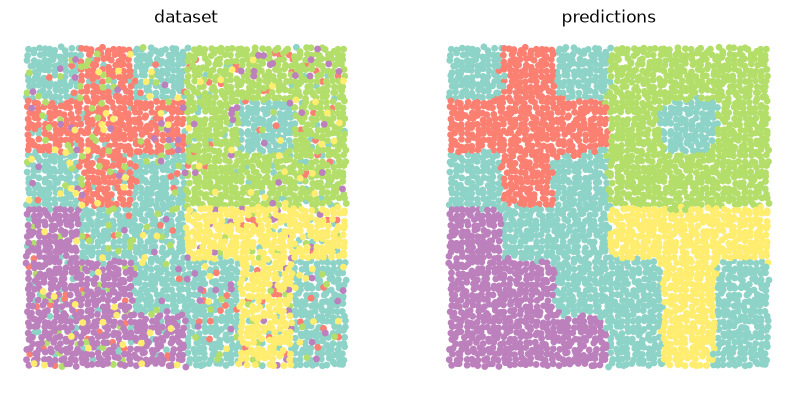

# Asterism - Experiments with Point Cloud Clustering

**Asterism** is a collection of semantic segmentation models and dimension reduction algorithms applied to point cloud data. Current methods include variations of latent Dirichlet allocation, some amortized topic models, and a neural clustering process. It also serves as a test bed for ATLAS, a nonparametric neural topic model for discovering an unknown number of spatial structures.

## Installation

Until I've had a chance to create a PyPI library, the easiest way to install **Asterism** is by cloning the source code:

### MacOS

```{}
git clone https://github.com/craigfouts/asterism.git
cd asterism
python -m venv .env
source .env/bin/activate
pip install -r requirements.txt
```

### Windows

```{}
git clone https://github.com/craigfouts/asterism.git
cd asterism
python -m venv .env
.env\Scripts\activate
pip install -r requirements.txt
```

## Usage

How to generate and cluster a noisy synthetic dataset using **ATLAS**:

```python
data, locs, labels = make_dataset(wiggle=.2, mix=.2, return_tensor=True, seed=0)
topics = ATLAS(seed=0).fit_predict(data, locs, labels)
show_comparison(locs, labels, topics)
```




Additional examples are provided in ```demos.ipynb```.
