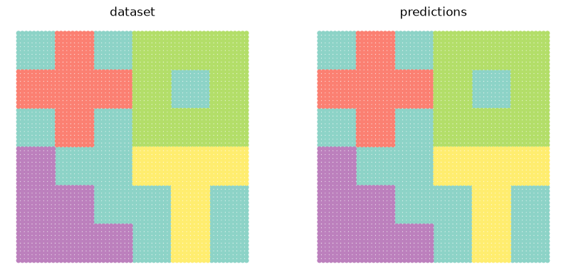
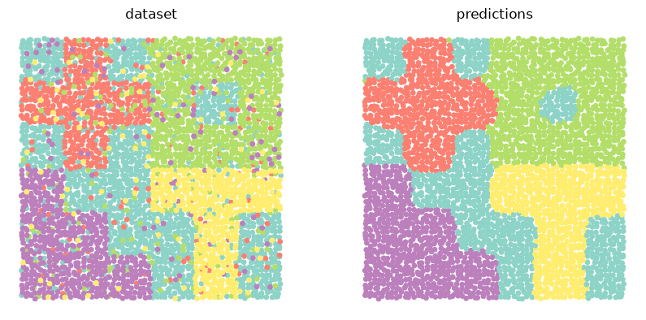

Examples
========

.. toctree::

ATLAS
-----

.. code-block:: python

    from asterism import ATLAS
    from asterism.utils.data import make_dataset
    from asterism.utils.plots import show_comparison

    data, locs, labels = make_dataset(wiggle=.2, mix=.2, return_tensor=True, seed=0)
    topics = ATLAS(seed=0).fit_predict(data, locs, labels)
    show_comparison(locs, labels, topics)

.. image:: ../assets/images/atlas.png
    :width: 100%

GibbsLDA
--------

.. code-block:: python

    from asterism import GibbsLDA
    from asterism.utils.data import make_dataset
    from asterism.utils.plots import show_comparison

    data, locs, labels = make_dataset(seed=4)
    topics = GibbsLDA(5, seed=4).fit_predict(data, labels)
    show_comparison(locs, labels, topics)

PyroLDA
-------

.. code-block:: python

    from asterism import PyroLDA
    from asterism.utils.data import make_dataset
    from asterism.utils.plots import show_comparison

    data, locs, labels = make_dataset(return_tensor=True, seed=3)
    topics = PyroLDA(5, seed=3).fit_predict(data, labels)
    show_comparison(locs, labels, topics)

.. image:: ../assets/images/pyrolda.png
    :width: 100%

GibbsSLDA
---------

.. code-block:: python

    from asterism import GibbsSLDA
    from asterism.utils.data import make_dataset
    from asterism.utils.plots import show_comparison

    data, locs, labels = make_dataset(wiggle=.2, mix=.2, seed=1)
    topics = GibbsSLDA(5, seed=1).fit_predict(data, locs, labels)
    show_comparison(locs, labels, topics)

NTM
---

.. tab-set::

    .. tab-item:: Softmax

        .. code-block:: python

            from asterism import NTM
            from asterism.utils.data import make_dataset
            from asterism.utils.plots import show_comparison

            data, locs, labels = make_dataset(return_tensor=True, seed=1)
            topics = NTM(5, seed=1).fit_predict(data, labels)
            show_comparison(locs, labels, topics)

    .. tab-item:: Dirichlet

        .. code-block:: python

            from asterism import NTM
            from asterism.utils.data import make_dataset
            from asterism.utils.plots import show_comparison

            data, locs, labels = make_dataset(return_tensor=True, seed=0)
            topics = NTM(5, mode='dirichlet', seed=0).fit_predict(data, labels)
            show_comparison(locs, labels, topics)

.. image:: ../assets/images/ntm.png
    :width: 100%

RSB
---

.. code-block:: python

    from asterism import RSB
    from asterism.utils.data import make_dataset
    from asterism.utils.plots import show_comparison

    data, locs, labels = make_dataset(return_tensor=True, seed=2)
    topics = RSB(seed=2).fit_predict(data, labels)
    show_comparison(locs, labels, topics)

.. image:: ../assets/images/rsb.png
    :width: 100%

VQAE
----

.. code-block:: python

    from asterism import VQAE
    from asterism.utils.data import make_dataset
    from asterism.utils.plots import show_comparison

    data, locs, labels = make_dataset(return_tensor=True, seed=1)
    topics = VQAE(5, seed=1).fit_predict(data, labels)
    show_comparison(locs, labels, topics)

.. image:: ../assets/images/rsb.png
    :width: 100%

NCP
---

.. code-block:: python

    from asterism import NCP
    from asterism.utils import batch_split
    from asterism.utils.data import make_dataset
    from asterism.utils.plots import show_comparison

    data, locs, labels = make_dataset(('polygons',)*5, return_tensor=True, seed=1)
    data_train, labels_train, data_test, labels_test = batch_split(data, labels, locs)
    locs_test = locs[-data_test.shape[1]:]
    topics = NCP(seed=1).fit(data_train, labels_train)(data_test)
    show_comparison(locs_test, labels_test, topics, title1='datasets (x4)')

.. image:: ../assets/images/rsb.png
    :width: 100%
